# EmbodiedVLA-RL

**A CPU-reproducible SO-ARM100 manipulation, Tiny-VLA, PPO, ROS2 and SLAM lab.**

[](https://github.com/chenjx421/mini-VLA/actions/workflows/test.yml)
[](https://www.python.org/)
[](https://mujoco.org/)
[](https://docs.ros.org/en/jazzy/)
[](LICENSE)

这是一个从物理仿真、示范数据、强化学习到视觉-语言-动作策略和 ROS2 系统集成的完整教学项目。
它不把“大模型 API + 简单环境”包装成 VLA，而是在约 1.39M 参数、CPU 可训练的尺度上，把
tokenization、multimodal fusion、action chunk、高分辨率语言 grounding、Flow Matching、
闭环控制和评测逐层实现出来。

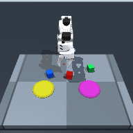

相同 100 个 seeds 的抓取口径对照：

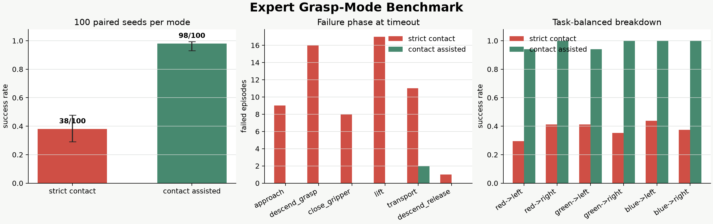

## What is implemented

- **Articulated manipulation**：MuJoCo Menagerie SO-ARM100 模型、5D 末端动作、DLS-IK、50 Hz
  控制、RGB-D、相机投影、接触力和 domain randomization。
- **Audited demonstrations**：120 条成功 episode、18,972 帧、6 种语言任务平衡采样、按
  episode 分层切分、SHA256 数据指纹和归一化统计。
- **Reinforcement learning**：从头实现 tanh Gaussian Actor-Critic、GAE、PPO policy/value
  clipping、entropy、KL early stop、并行 rollout 和独立闭环评测。
- **Tiny-VLA**：图像 patch、语言 token、15D proprioception、Transformer fusion、8-step
  continuous action chunk、phase/3D auxiliary head，以及 8 x 8 到 16 x 16 的语言条件
  target/goal grounding。
- **Generative actions**：相同 encoder 下对比 deterministic regression 与 Flow Matching
  action head，支持迭代 Euler sampling。
- **ROS2 + SLAM**：机械臂 RGB-D/CameraInfo/JointState/TF/VLA action bridge 及自动消息
  probe；移动 LiDAR/Odometry/TF bridge；ROS2 Jazzy `slam_toolbox` 建图和时间对齐轨迹记录。
- **Evidence-first workflow**：run directory 锁、断点续训、数据指纹校验、逐 episode JSONL、
  checkpoint metadata、失败 GIF 和可重建图表。
- **完整工程复盘**：[`docs/engineering/project_journal.md`](docs/engineering/project_journal.md)
  保留从任务漏洞、性能诊断到闭环失败和 DAgger 纠错的完整过程，包含证据、决策和未完成项。

## Verified results

所有数字均来自仓库脚本生成的 JSON，不手工修改。离线指标、direct policy 和 hybrid policy
严格分开报告。

| Experiment | Scope | Verified result |
| --- | --- | --- |
| Expert controller | `contact_assisted`, paired seeds 10000-10099 | 98/100, Wilson 95% CI 93.0%-99.4% |
| Expert controller | strict MuJoCo `contact`, same paired seeds | 38/100, Wilson 95% CI 29.1%-47.8% |
| Expert dataset v2 | 3 colors x 2 goals, domain randomized | 120 episodes, 18,972 frames, 1 rejected attempt |
| PPO reach, 3 seeds | privileged state, 100,352 steps/seed, 20 eval/seed | 58.3% mean, 33.3% sample std; pooled 35/60 |
| Tiny-VLA offline, epoch 15 | episode-disjoint validation | 0.0644 action MAE, 95.1% phase accuracy, 0.0351 grounding L2 |
| Direct Tiny-VLA closed loop | Stage 5 action chunk, 12 development episodes | 0/12; retained as a failed diagnostic |
| Hybrid Tiny-VLA final-v2 | 60 untouched, task-balanced seeds | 34/60 success, Wilson 95% CI 44.1%-68.4% |
| Hybrid task funnel | same 60 episodes | 39 contact/grasp/lift, 34 final placements |
| Domain-randomized robustness | 30 new balanced seeds | 18/30 success, Wilson 95% CI 42.3%-75.4% |
| CPU inference | i5-13420H, one Torch thread | p50 18.17 ms, p95 48.27 ms |
| ROS2 arm probe | WSL2, ROS2 Jazzy | 11/11 schema/data/TF checks passed |
| ROS2 SLAM capture | 60 s, strong synthetic odometry noise | 123 x 118 map at 0.05 m/cell; endpoint error 1.59 m odom, 0.84 m SLAM |

`contact_assisted` 只有在双指接触且夹爪关闭后才激活稳定约束，但仍比严格摩擦抓取简单。它与
`contact` 结果始终分开报告。

原 Tiny-VLA checkpoint 的开发闭环为 0/2 timeout；进一步诊断发现 episode 初始首动作 MAE
为 0.3357，远高于全局首动作 MAE 0.0568。DAgger、Cartesian proprio 和 3D grounding 将问题
逐层缩小，但 Stage 5 direct action 仍是 0/12。最终成功结果来自明确标注的 hybrid policy：
Tiny-VLA 从 RGB 和语言定位目标，train-only calibration 与相机几何恢复世界坐标，再由
Cartesian visual servo、接触状态机和局部搜索执行。action path 从不读取仿真 target/goal
真值；真值只用于评测。

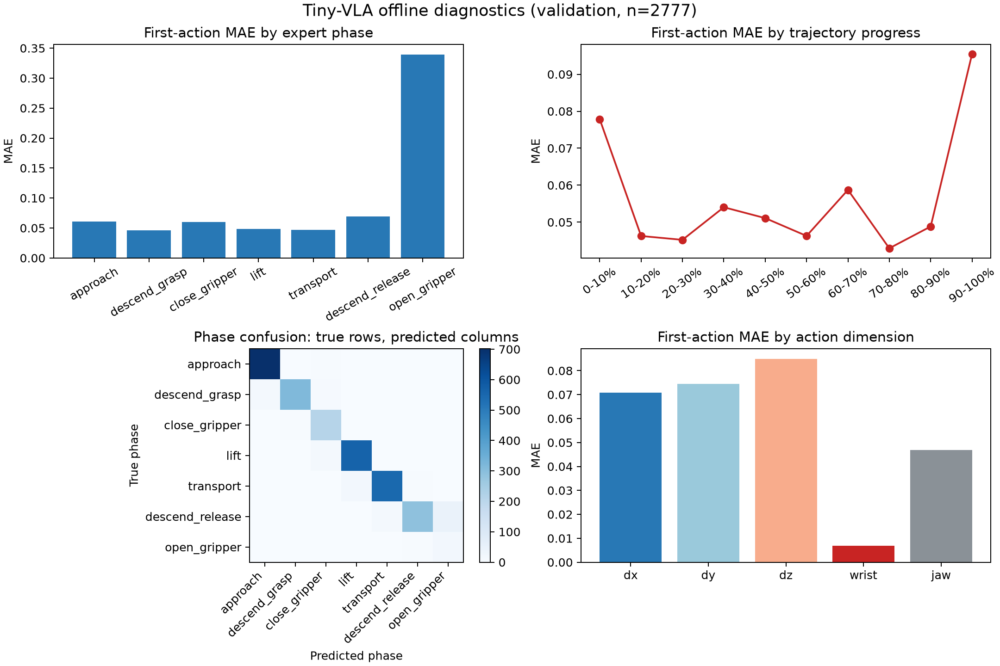

### Final closed-loop evidence

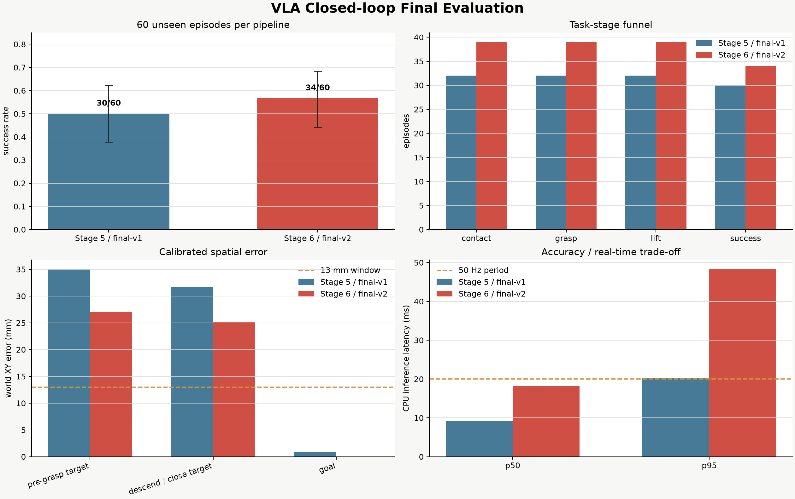

Stage 6 冻结原动作主干，只训练 145,601 个高分辨率 grounding 参数。验证集 target 世界 XY
误差从 Stage 5 的 31.56 mm 降到 27.27 mm；再用只在 train split 拟合的校正降到 24.30 mm。
在独立 final-v2 中，接触从 32/60 增至 39/60，最终成功从 30/60 增至 34/60。两次 final 的
Wilson 区间重叠，因此只报告“观察到提升”，不声称统计显著。

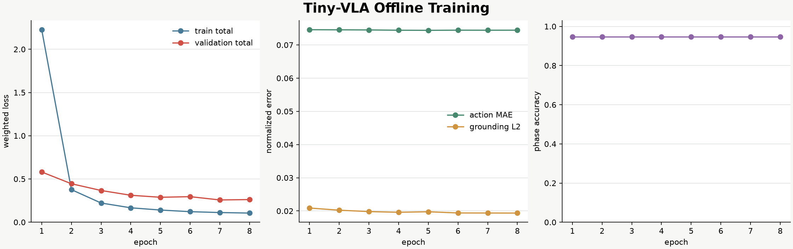

成功轨迹：

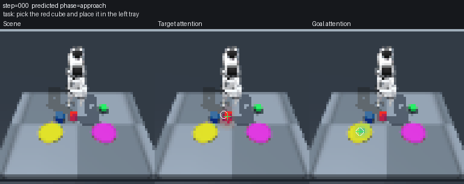

失败轨迹也保留。典型失败在视觉落点附近完成局部搜索后仍未建立双指接触：

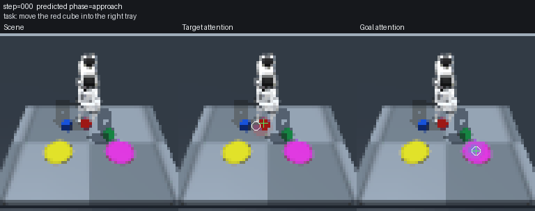

冻结相同 pipeline 后，在另一组 30 条任务均衡 seed 上开启光照、相机和物理 domain
randomization，得到 18/30。区间与 clean final 大幅重叠，因此这里只证明“没有观察到明显崩溃”，
不声称随机化提高成功率。

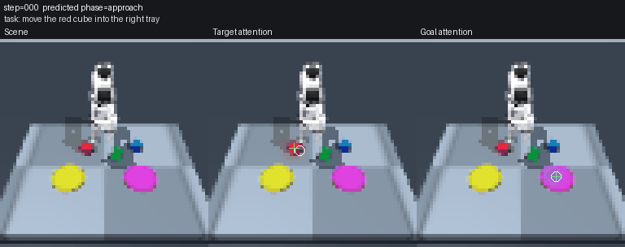

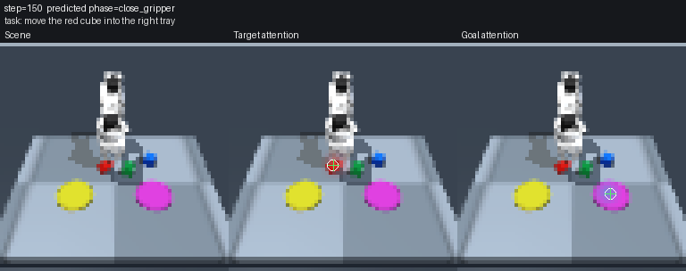

### Failure analysis and DAgger

闭环 evaluator 在 learner 状态上额外查询一个不执行动作的 privileged expert，从而找到模型与
专家的第一处分叉。下图中 target/goal grounding 基本正确，但策略在没有接触时已经预测
`open_gripper`，说明问题不能只归因于视觉定位。

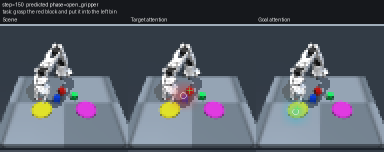

第 1 轮 DAgger 使用 `beta=0.5` 的 learner/expert 混合控制，采集 4,225 个 learner-visited
correction states；未来 action 未被伪造，correction chunk 只监督实际查询到的第 1 步。

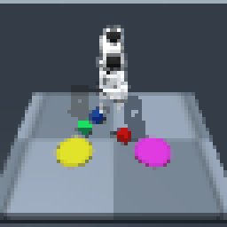

第 2 轮将 expert mixing 从 `beta=0.5` 降到 `0.2`，重点收集 learner 在 approach waypoint 和
阶段边界附近的状态。

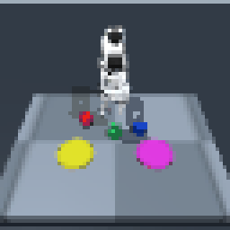

## System architecture

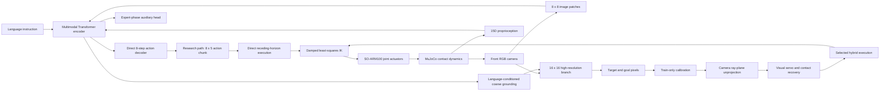

### Tiny-VLA tensor path

```text
RGB [B,3,64,64] -> 64 coarse vision tokens \
language [B,16] -> 16 language tokens         -> 82-token encoder memory
proprio [B,15]  -> 1 proprio token           /
task token      -> 1 task token              /

8 action queries -> Transformer decoder -> action chunk [B,8,5]
2 grounding queries -> coarse heatmaps [B,2,8,8]
coarse grounded query x high-res CNN keys -> heatmaps [B,2,16,16]
task token -> phase head -> logits [B,7]
grounded features -> target/goal world-coordinate auxiliary head [B,2,3]
```

## Data audit

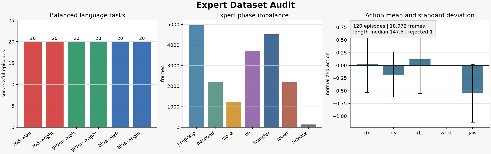

正式数据集已经跟随仓库提供。重新审计：

```bash
python -m pip install -e ".[dev]"
evla-audit-dataset datasets/so_arm_pick_place_v2_120_dr
```

预期 fingerprint：

```text
42c36938e5157cf9e188413e5d4cb76cb85b0f551752853a8e8d18a7c77914b3
```

图中 wrist 动作标准差为零，因为当前立方体任务不要求调整物体朝向。这会美化总体动作误差，因此
训练器同时报告 5 个动作维度 MAE；有朝向物体是明确扩展项。

## Quick start

### Windows / Linux CPU

```bash
python -m venv .venv
```

Windows PowerShell：

```powershell
.\.venv\Scripts\python -m pip install --upgrade pip
.\.venv\Scripts\python -m pip install -e ".[dev]"
evla-check-env --episodes 2 --image-size 192 --save-frame outputs\smoke.png
```

Linux：

```bash
source .venv/bin/activate
python -m pip install --upgrade pip
python -m pip install -e ".[dev]"
MUJOCO_GL=egl evla-check-env --episodes 2 --save-frame outputs/smoke.png
```

### Run the expert

```bash
evla-expert-demo \
  --episodes 10 \
  --seed 100 \
  --image-size 192 \
  --save-gif outputs/expert.gif
```

### Train PPO

```bash
evla-train-ppo \
  --task reach \
  --total-steps 100000 \
  --seed 1 \
  --eval-episodes 20 \
  --output-dir outputs/ppo_reach_seed1
```

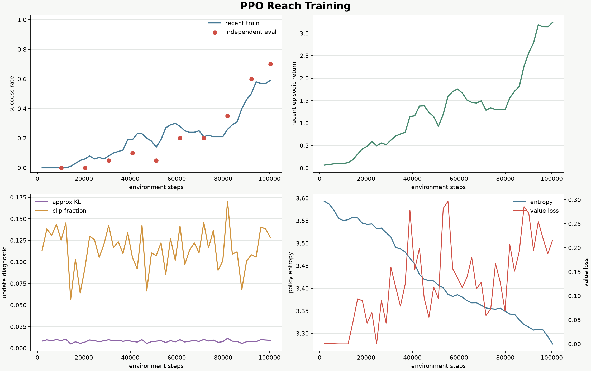

三 seed 结果显示初始化敏感性，不能用 seed 3 的 80% 代替总体结论：

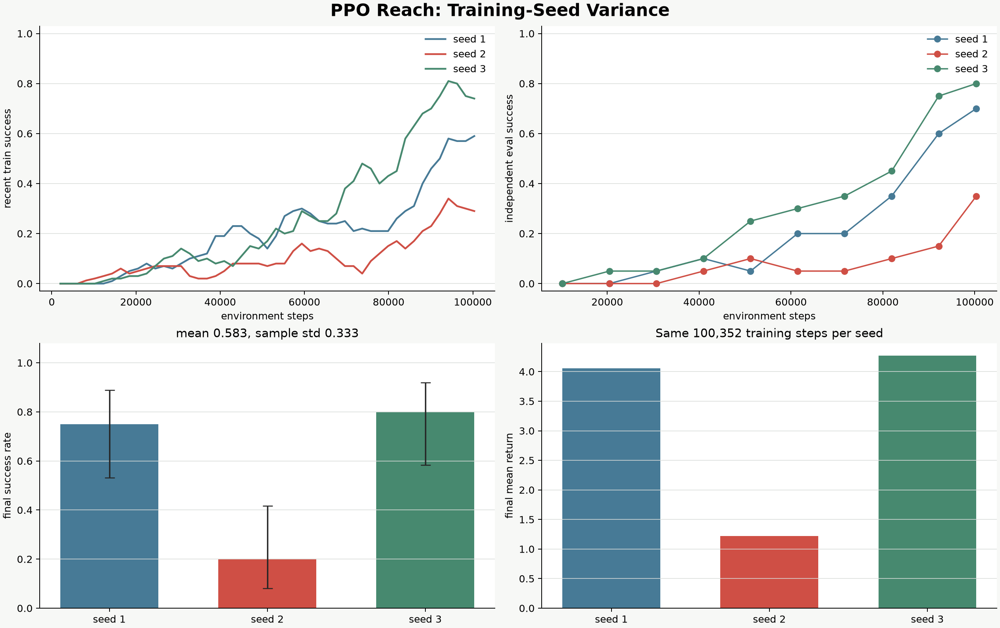

### Train Tiny-VLA

```bash
evla-train-vla \
  --dataset datasets/so_arm_pick_place_v2_120_dr \
  --output-dir outputs/tiny_vla_det_seed1 \
  --image-size 64 \
  --action-horizon 8 \
  --action-head deterministic \
  --epochs 15 \
  --batch-size 64 \
  --seed 1
```

断电或中断后显式恢复：

```bash
evla-train-vla \
  --dataset datasets/so_arm_pick_place_v2_120_dr \
  --output-dir outputs/tiny_vla_det_seed1 \
  --image-size 64 \
  --action-horizon 8 \
  --action-head deterministic \
  --epochs 15 \
  --batch-size 64 \
  --seed 1 \
  --resume-checkpoint outputs/tiny_vla_det_seed1/checkpoints/best.pt
```

### Closed-loop evaluation

```bash
evla-eval-vla-hybrid \
  --checkpoint checkpoints/tiny_vla_stage6_highres.pt \
  --grounding-calibration checkpoints/tiny_vla_stage6_calibration.json \
  --output-dir outputs/hybrid_eval \
  --episodes 60 \
  --seed 60000 \
  --max-episode-steps 400 \
  --recovery-search-radius-m 0.018 \
  --close-retry-steps 18 \
  --video-episodes 3
```

离线 action MAE 不是任务能力。最终结论使用 unseen-seed、六任务均衡的 MuJoCo closed-loop
success，并同时保存逐 episode JSONL、grounding panel、成功/失败轨迹、Wilson 区间和延迟。
使用 seed 60000 会复现实验条件，不会创造一组新的未见测试集。

## ROS2 and SLAM

SLAM 被放在独立移动传感平台上，因为固定桌面机械臂不需要 SLAM。该边界避免为了关键词制造错误
依赖，同时保留未来移动操作的组合空间。

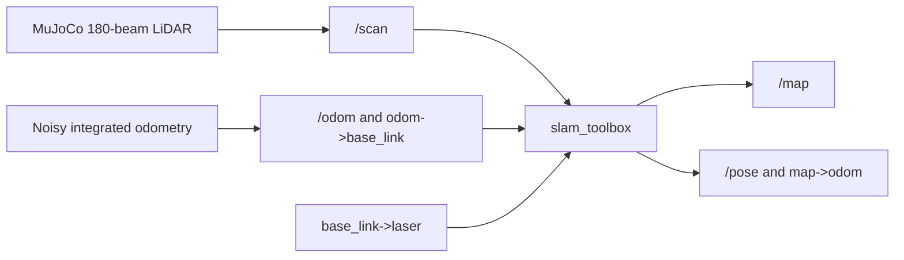

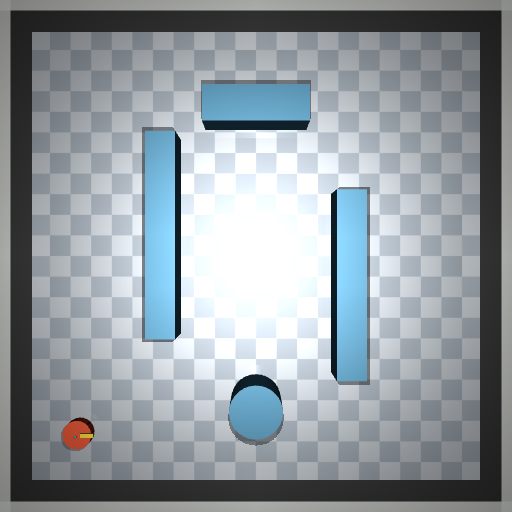

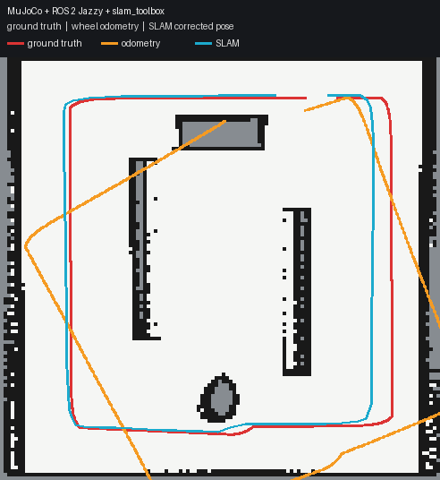

机械臂 bridge 已在 WSL2 ROS2 Jazzy 中做真实消息探测：6 个关节、RGB8、32FC1 深度、
CameraInfo、任务 metadata 和 camera TF 共 11 项检查全部通过。

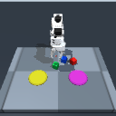

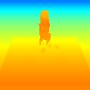

在 Ubuntu 24.04 / ROS2 Jazzy：

```bash
cd ros2_ws
source /opt/ros/jazzy/setup.bash
colcon build --symlink-install
source install/setup.bash
ros2 launch embodied_vla_ros mobile_slam.launch.py
```

另一个终端记录地图和轨迹：

```bash
source /opt/ros/jazzy/setup.bash
source ros2_ws/install/setup.bash
ros2 run embodied_vla_ros slam_recorder \
  --output-dir outputs/ros_slam_capture \
  --duration 60
```

也可使用：

```bash
docker compose up --build slam
```

机械臂 bridge 的可重复 probe：

```bash
colcon build --symlink-install
bash scripts/run_ros_arm_probe_wsl.sh outputs/ros_arm_probe
```

## Learn it, do not just run it

| Chapter | What you must be able to explain |
| --- | --- |
| [00 学习路线](docs/learning/00_curriculum.md) | 14 天任务与三次里程碑答辩 |
| [01 具身基础](docs/learning/01_embodied_foundations.md) | embodied loop、MDP/POMDP、state/observation、sim-to-real |
| [02 MuJoCo 与控制](docs/learning/02_mujoco_kinematics_control.md) | MJCF、正运动学、Jacobian、DLS-IK、接触 |
| [03 数据与 VLA](docs/learning/03_data_imitation_vla.md) | episode split、Transformer、action chunk、grounding、Flow Matching |
| [04 PPO](docs/learning/04_reinforcement_learning_ppo.md) | Actor-Critic、GAE、clipped objective、timeout bootstrap |
| [05 ROS2 与 SLAM](docs/learning/05_ros2_slam.md) | topic/QoS/TF、LiDAR、occupancy grid、scan matching、loop closure |
| [06 实验方法](docs/learning/06_experiment_method.md) | 多 seed、置信区间、消融、失败分类、claim ledger |
| [07 简历与答辩](docs/learning/07_resume_interview.md) | 简历写法、30 秒介绍、白板题和不能写的结论 |
| [08 四天动手工作簿](docs/learning/08_hands_on_workbook.md) | 逐日命令、代码入口、预测记录、亲手改动和模拟面试 |
| [最终简历条目](docs/resume/README.md) | 四条项目经历、30 秒介绍、数字证据和禁止夸大项 |

MuJoCo 两天实操入口：[`mujoco_course/README.md`](mujoco_course/README.md)，第一段可运行代码：
[`mujoco_course/lesson00_smoke.py`](mujoco_course/lesson00_smoke.py)。

GitHub 项目调研与设计取舍见
[GitHub Mini-VLA Design Audit](docs/research/github_vla_audit.md)。

## Repository layout

```text
embodied_vla/
  algorithms/       # PPO and GAE
  assets/           # SO-ARM100 and MuJoCo worlds
  control/          # DLS inverse kinematics
  data/             # demonstration collection, audit, episode split
  envs/             # manipulation and mobile SLAM environments
  evaluation/       # closed-loop Tiny-VLA evaluation
  experts/          # physical waypoint expert
  models/           # actor-critic and Tiny-VLA
  training/         # trainers, checkpoints, resume guard
ros2_ws/            # ROS2 arm/mobile bridges and slam_toolbox launch
datasets/           # tracked audited demonstrations
docs/               # figures, research audit, Chinese course
tests/              # physics, algorithm, data, model and regression tests
```

## Honest limitations

- 当前是 MuJoCo 仿真，不声称已经部署到 SO101 真机。
- VLA 从零训练，适合研究结构，不是 foundation model。
- 34/60 是 VLA grounding 驱动的 hybrid policy，不是 direct action decoder 的成功率；
  direct Stage 5 开发评测为 0/12。
- 单帧 policy 无法显式恢复遮挡状态或速度历史。
- `contact_assisted` 结果不能替代严格接触抓取结果。
- 当前物体无朝向要求，wrist action 缺少有效监督。
- Stage 6 的 CPU p95 48.27 ms 超过 50 Hz 的 20 ms 控制周期，存在实时性尾延迟。
- 30-episode domain-randomized run 样本较小；其 latency 在后台并发负载下采集，不能与前台
  clean run 做受控性能比较。
- goal side 只有左右两个固定站点，语言条件 goal calibration 接近零误差不代表一般目标定位。
- SLAM 使用合成 LiDAR 和偏强里程计噪声，结果不是硬件精度声明。

第三方 SO-ARM100 资产来自
[MuJoCo Menagerie](https://github.com/google-deepmind/mujoco_menagerie)，许可证见
[THIRD_PARTY.md](THIRD_PARTY.md) 和资产目录内的 Apache-2.0 `LICENSE`。

## License

项目代码采用 [MIT License](LICENSE)。第三方资产遵循各自许可证。
